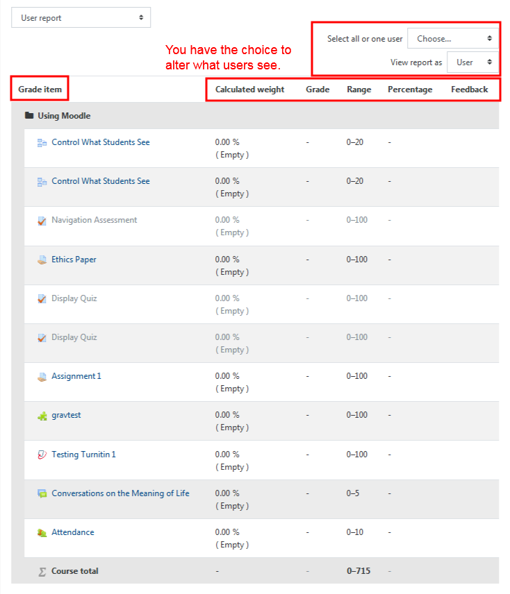
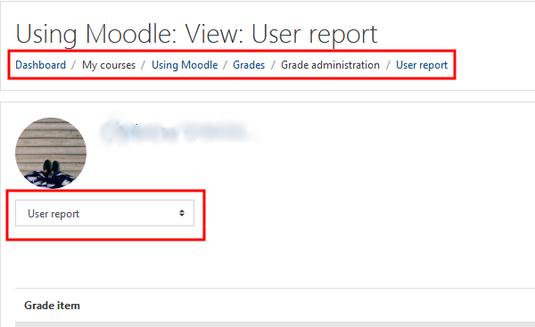
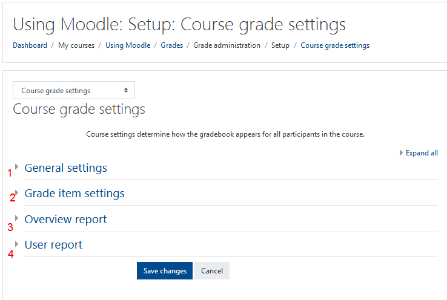
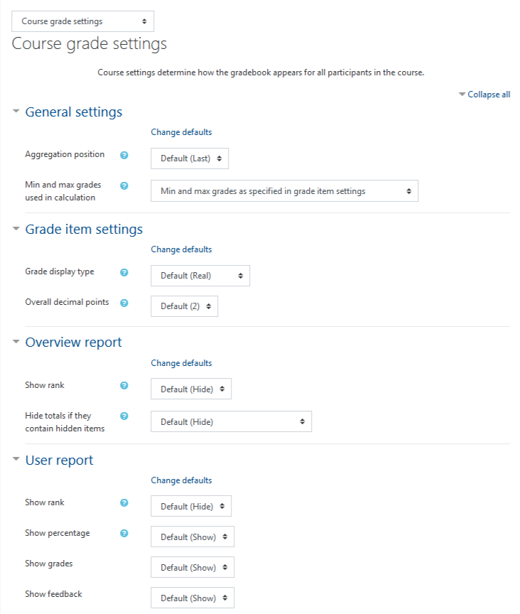
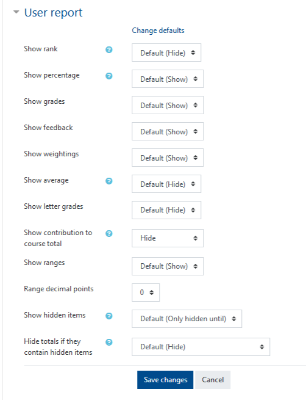

#### The User Report setting is a very important function.

This provides you the option of hiding or showing certain elements on the user report. If there are questions about any of the functions be sure to select the question mark on each of the items for more details. The following instructions helps you as a professor to determine how students will see their grades \(User Report\).

#### So what does a default user report look like? Below is a user view of what can be seen.

#### Select 'Grades' then 'Course Grade Settings' from the drop down menu.

#### So, you've found the page.

The following are the details on what each section on this page can assist you to do.

1. General settings: This setting determines whether the category and course total columns are displayed first or last in the gradebook reports.
2. Grade Item Settings: This allows you to determine how a grade is displayed on the User report. You can also determine how many decimal points are displayed.
3. Overview report: You can choose to display what position in class a student might be, is also allows you to manage hiding totals if items are missing.
4. User report: This contain a number of functions which determines what content students see when they access their grade report. You can show and hide the appropriate items.

#### General Settings, Grade Item Settings and Overview Report expanded.

#### User report settings

#### Once you've chosen your settings feel free to Save Changes.

You can always take a look again at how each user will see their grade report by going back to User Report from the drop down menu on the top left hand corner of the page.
