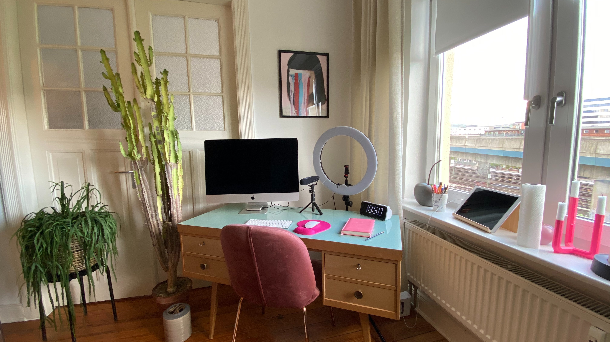
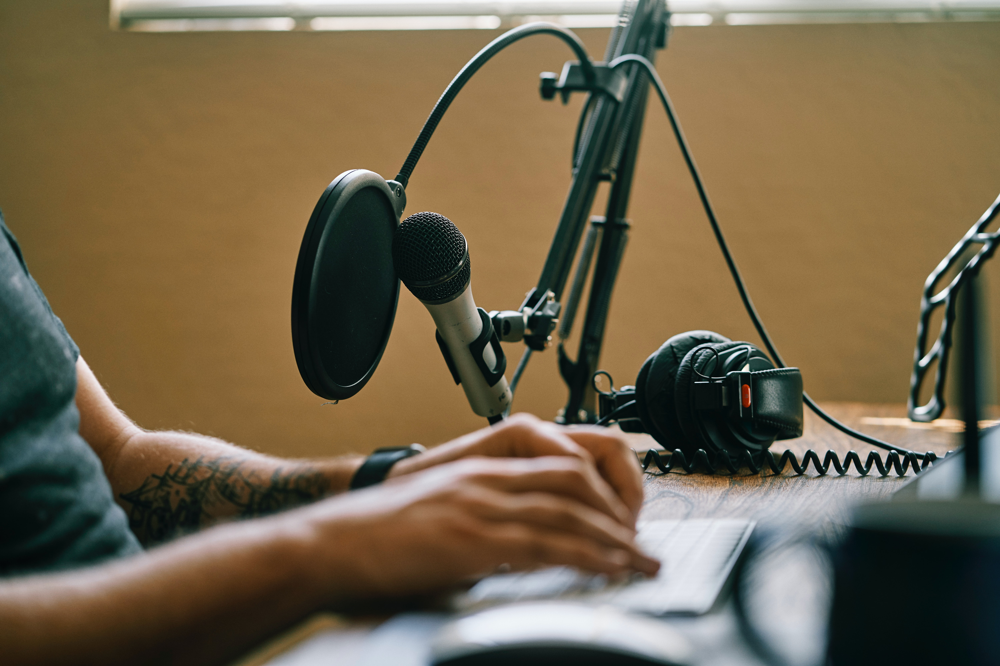
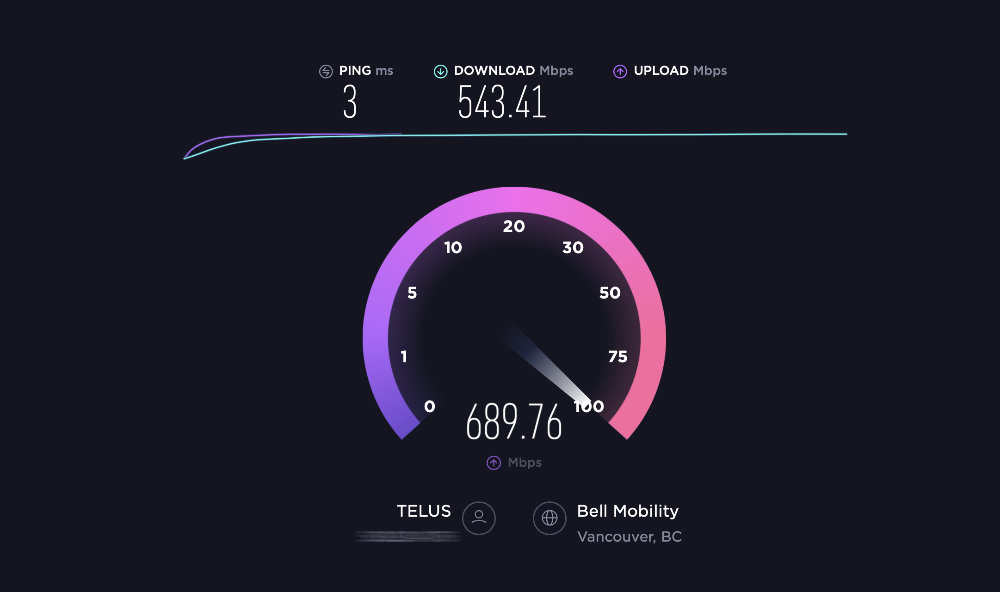
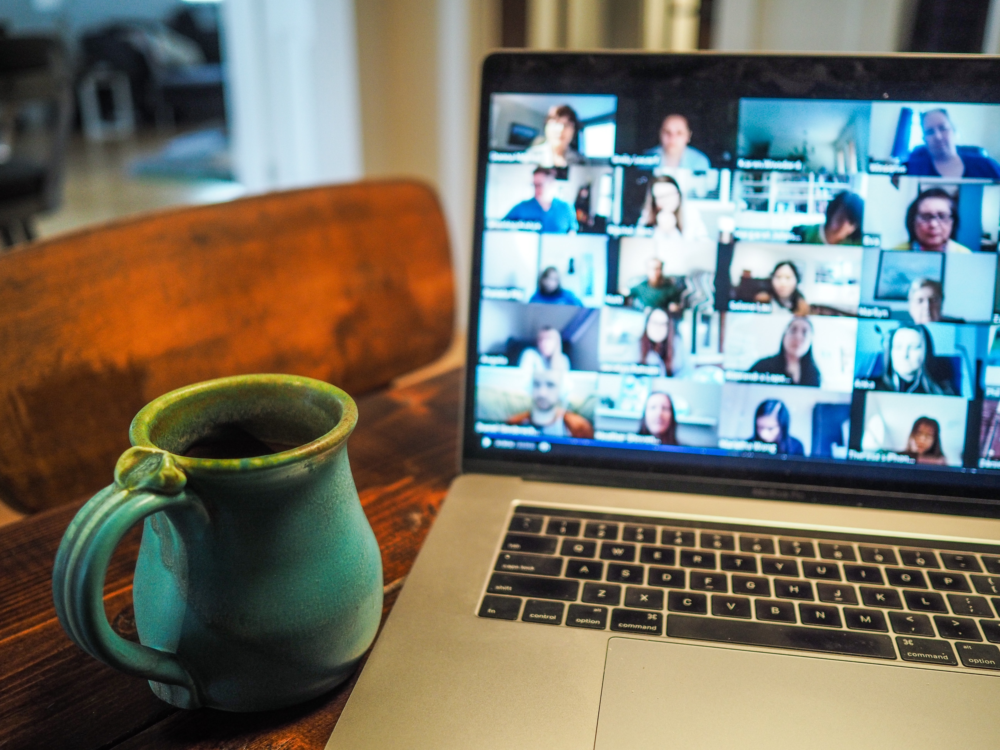

### Sorting Through Your Techy Video Issues

The purpose of this quick start guide is to help you sort through some of the technical logistics of teaching online. This guide covers hardware recommendations, setting up the ideal recording environment, assessing your internet speed, and running an online class session. More detailed instructions, buying recommendations and other relevant info are linked throughout the guide.©

<iframe src="https://player.vimeo.com/video/613908225?h=ec7404e57a" width="640" height="360" frameborder="0" allow="autoplay; fullscreen; picture-in-picture" allowfullscreen></iframe>

<a href="https://vimeo.com/613908225">Inclusive Classroom Demo</a> from <a href="https://vimeo.com/twuglobalonline">Trinity Western Online</a> on <a href="https://vimeo.com">Vimeo</a>.

### Step 1: The Hardware

Before we dive in, let’s take a moment and make sure you have all the tools you’ll need for the job. At minimum you will need a computer, a camera, and a microphone. There is more gear that might be relevant to you, but we’ll address that later.

#### The Computer
If you’ve had your computer for 5 years or less, it will most likely be able to handle most video conferencing software. Take a moment to consider the following system requirements for Zoom ([Mac](https://www.youtube.com/watch?v=Gtd5k4lnWDM) or [Windows](https://www.google.com/search?client=firefox-b-d&q=find+windows+system+specs)):
- 2.5Ghz Dual Core Intel Core i5 (or higher) Processor
- 4GB Ram

**More Info:** https://bit.ly/382O2hI

#### The Camera
If your computer is a laptop with a built-in webcam, this will most likely be the simplest option for you. When it comes to cameras, bigger is not necessarily better, especially as technology continues to shrink down.

If you need to purchase a webcam, please consider something that would be capable of recording at HD resolution (1080p).

**OBSBOT Camera:** https://www.obsbot.com/obsbot-tiny

**Webcam:** https://amzn.to/2ZfIRH4

#### The Microphone
For your convenience you might be tempted to use your built-in microphone. Please don’t. Due to the proximity of the built-in mic to the noise transmitting parts of you computer (fans, hard drives, electric signals), the audio quality will suffer. For this reason we **STRONGLY** recommend using an external microphone. It will even make you look better (*user experience may vary*)! If you do not have something that will work yet, below are a couple of recommendations.

##### Wired Mic
If you don’t mind being tethered to your computer, and want something simple that will just work.

**Wired Mic:** https://amzn.to/2NB7pF2

**Wireless Mic:** https://amzn.to/3kGxbJI

**Wired Headset W/ Mic:** https://amzn.to/2ZcmlPx

##### Wireless Mic
Enjoy unrestricted movement as you teach! But be mindful of potential connectivity issues depending on bluetooth strength or signal interference. Also remember to keep it charged before class.

**Wireless Headset:** https://amzn.to/31i26Te
### Step 2: The Setup

Great! Now that we have a working computer, camera and microphone, let’s talk about the ideal recording setup.

#### A Quiet Space
Hopefully you know a quiet space, free from distracting noises, pets or people. Keep this in mind when recording ([or presenting on live tv](https://www.youtube.com/watch?v=Mh4f9AYRCZY)). Is there a door or window that could be closed? Is the dryer running in the next room? Is your phone on silent? Is There a fan blowing directly at your microphone? By limiting background noise you can greatly increase the quality of your recordings.

#### "What's That in the Background?"
So your room is quiet now. Great! But what does it look like? By keeping your recording background tidy, and free from visual clutter, you will help your students remain focused on what they are learning. They hopefully won’t be able to see your dog’s mournful, accusatory stare, just outside your office window.

#### Lighting
- Speaking of windows, when it comes to video quality, it’s important to remember not to record in the dark. If your recording space is too dark your students  will notice distracting image noise as your camera struggles to keep you visible.
- It’s also important to ensure that you have more light hitting your face than hitting the background behind you. Otherwise you risk being mistaken for a talking shadow. If a window does appear in your background, you might want to have the curtains pulled shut to ensure your background isn’t brighter than you (also your sad dog won’t be visible).
- To ensure your face is well lit, we recommend recording with a cheap ring light. The light should be directed towards you, at about the same distance as your camera.
- If you are feeling adventurous you could also [experiment with natural lighting](https://www.youtube.com/watch?v=j7Rf6u-XveM).

**Ring Light:** https://amzn.to/2NyCPMo

#### Camera Position
- Let’s make you look great! **Ideally your camera should be positioned to line up with your eyes.** This is the most natural, flattering angle (no-one wants a double chin).
- Unless teaching with whiteboard, or teaching aids, you should be in the centre of the frame with just a little bit of space between your head and the top of the frame.

There are a few options for positioning your camera to eye height:

- If you use a **laptop with built-in webcam** you can use a laptop riser in combination with an external keyboard and mouse. In addition to helping adjust the working height of your laptop, a laptop riser can help with cooling. Video conferencing (really anything video related) does put extra strain on your processor, so keeping the laptop elevated allows for better airflow from the vents, better cooling, less processor strain, and less risk of video stutter.
- If you use an **external webcam**, you could use a cheap tripod, extension arm, or if you have a height-adjustable external monitor, you could clip the webcam to the top.

**Adjustable Laptop Riser:** https://amzn.to/2VozzYe

**Camera Arm:** https://amzn.to/3dCQAnK

**Selfi Tripod:** https://amzn.to/2YCJiw0

### Step 3: Internet Connection

If you plan to teach over Zoom (not pre-recorded and uploaded), you should have a high speed internet connection with at least a **download/upload speed of 20Mbps.** Although you could get by with lower speeds, we want to offer students the highest quality stream possible. You can check your connection speed at [speedtest.net](https://www.speedtest.net). Keep in mind that other people or devices on your network will can impact your speed test. If you do not have a high enough bandwidth, **you might want to ask members of your household not to stream or download during your recordings** as this could negatively impact the stability of your Zoom meeting.

### Step 4: Running A Class Session

Let’s go through the software and systems you will using as you run your class.
#### Moodle
You should be aware that as of June 15, 2020, TWU has shifted away from MyCourses as our learning management system (LMS). Now we are using Moodle. There is great training available on Moodle which you can find as [a part of the Online Learning On-Ramp](https://create.twu.ca/help/online-learning-on-ramp/multi-access/moodle).
#### Zoom
For instructions on downloading, signing in and using Zoom, [click here.](https://create.twu.ca/help/online-learning-on-ramp/running-a-session/conferencing)
There are a few great video tutorials that should answer most of your questions.
#### Recording A Zoom Meeting
The following brief video explains the recording process, as well as where to find your files once your session is over.
https://bit.ly/38b3w3h

**Ensure that you hit the record button** at the beginning of your teaching time (lower right hand corner of the Zoom user interface).

#### Uploading
Once your Zoom session is over, you will need to [upload your Zoom recordings to Microsoft Stream](https://create.twu.ca/help/online-learning-on-ramp/running-a-session/conferencing/managing-videos).

By now you should feel equipped with an understanding of the hardware, setup and systems required to run your classroom virtually. Should you need any assistance, please contact [elearning@twu.ca](mailto:elearning@twu.ca).
