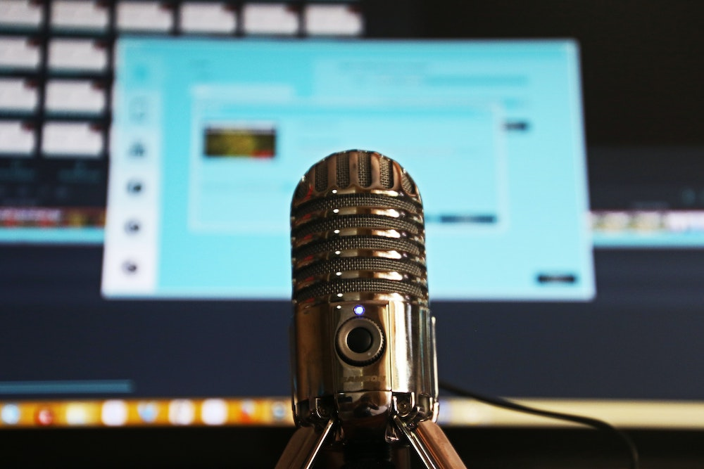
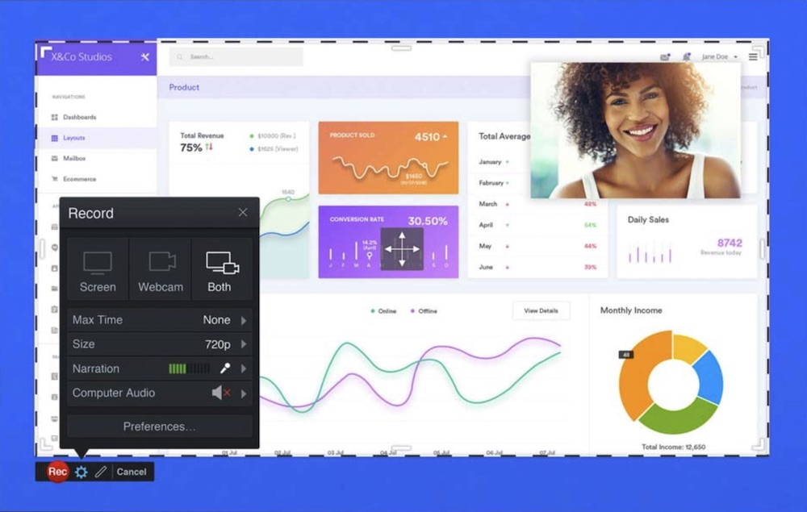
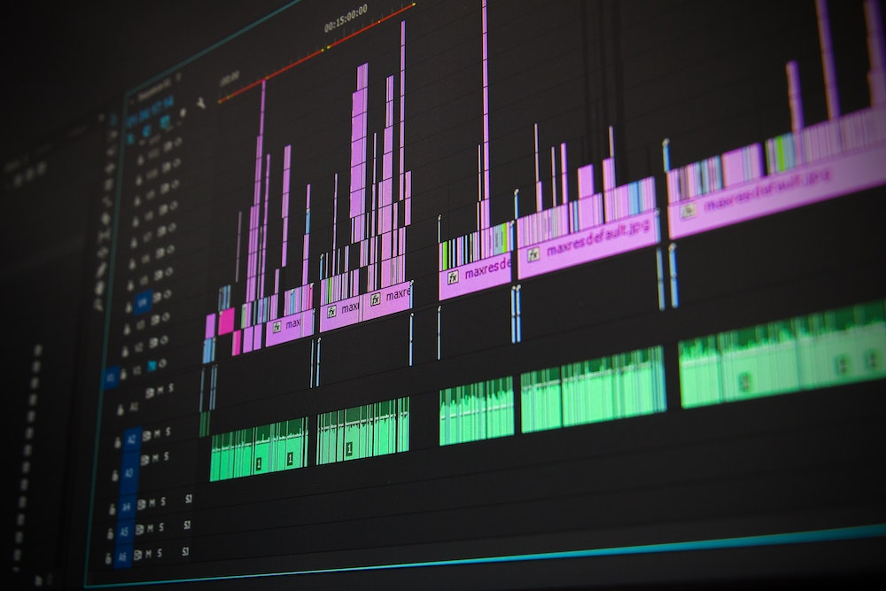
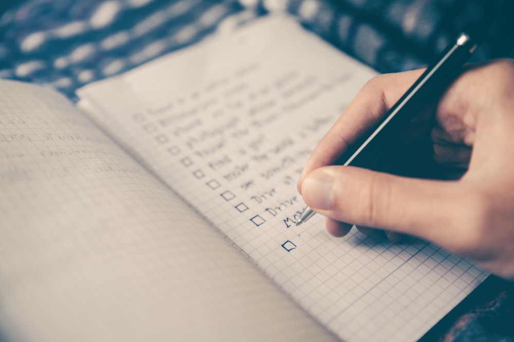

Covid-19 has certainly changed the way we see the world and what our educational experience looks like. Much of our class time is now online. But with these new restrictions comes a new opportunity for creativity. You may find that your instructors are asking you to submit your assignments in a digital fashion.  Our hope is to inspire you as you begin to plan your multimedia assignments. Below is a list of some of our favourite digital tools.

We have organized this list from easiest to techiest.   

#### Making Movies with PowerPoint

Did you know that PowerPoint can do more than make a slide show?  [This video tutorial](https://youtu.be/D8JV3w4TOVw)  shows you how you can transform your slides into a full video presentation.

#### Screen Recording

#####Screencast-o-matic
This next one is a freemium screen recorder.  What we mean by that is that the free version is basic and very functional, but to edit with this tool requires you to purchase a plan.  Why do we like it?  It’s pretty easy to use and it’s another option if you’re not a Powerpoint or Zoom fan.

[Screencast-o-matic Tutorial](https://screencast-o-matic.com/tutorial/welcome-to-screencast-o-matic)

Great news! If you've tried SOM and  you like it, you can request the full version through [TWIT](https://trinitywestern.teamdynamix.com/TDClient/1904/Portal/KB/ArticleDet?ID=16267).

#####Zoom - More Than Just a Meeting Space
Most people think that Zoom is only for meetings; however, it works well as a recording tool too with some handy features to boot.  

[Zoom Screen Recording Tutorial](https://youtu.be/yii4M5204SE)

&nbsp;
   

####But I Don't Have a Camera!

You probably do have a camera. You probably use every day. Recording great quality video from a smartphone isn’t too difficult, but you may need to think re-think your setup.

[Shooting on an Android Smartphone](https://youtu.be/8YiwBsTQ_c0)

[Shooting on an iPhone](https://youtu.be/Co21Gw7zqNY)

####Video Editing

When it comes to video editing, there are a few great (and free) options.
#####Avidemux
* Very fast for trimming or adding clips together
* Limited capabilities
* A little unintuitive

[Avidemux Tutorial](https://web.microsoftstream.com/video/3cb88467-895c-4ab9-8e43-47b171714d48)

#####Openshot
* Simple
* Solid editing functionality

[Openshot Tutorial](https://youtu.be/TeKRsMO_6Rw)

#####Windows 10 Video Editor
* Included with Windows 10
* Simple
* Gimmicky

[Windows 10 Video Editor Tutorial](https://youtu.be/t6yQwLuoO3w)

#####Davinci Resolve
* Super powerful
* Professional grade
* Requires a powerful computer
* Not super intuitive
* Great option for a would-be professional editing

[Davinci Resolve Tutorial](https://youtu.be/63Ln33O4p4c)

####Planning Tips

1. Make a script, plan out what you want to say.
2. Practice before you hit the record button.
3. Organize and label your files before you begin to edit. This will save you a lot of time.
4. Use transitions, annotations and animations strategically.
5. If you add background music, ensure it doesn’t detract from your narration.

Check our other guides for more info on [how to setup your webcam](https://create.twu.ca/help/online-learning-on-ramp/quick-start-guides/video) or [looking professional on camera](https://create.twu.ca/help/online-learning-on-ramp/quick-start-guides/on-screen). Should you need any additional assistance, please contact [elearning@twu.ca](mailto:elearning@twu.ca).
