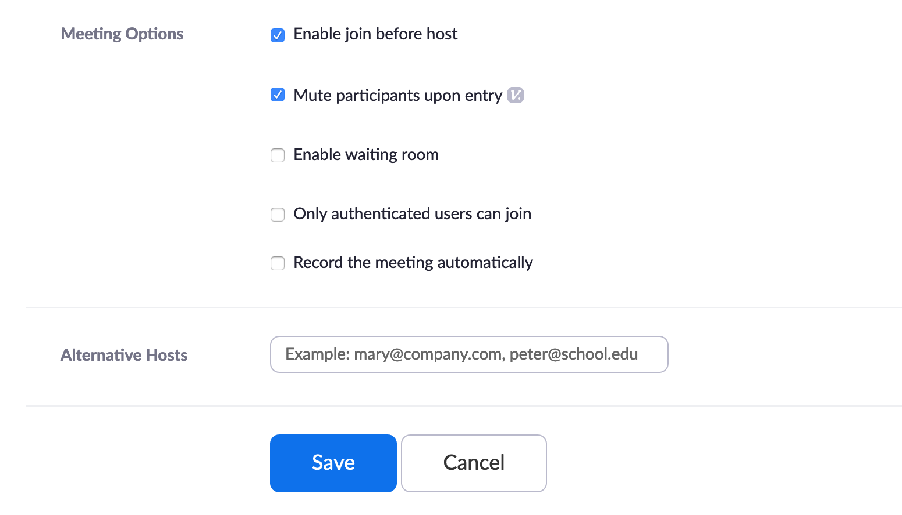

Video conferencing is a great way to connect with students online. Consider having weekly sessions, allowing time to teach content, explain assignments, facilitate student discussions, and assess students (presentations, etc.)

! Note that you can record these sessions and [post them to MS Stream](https://create.twu.ca/help/online-learning-on-ramp/running-a-session/conferencing/managing-videos) so students can access the recordings.

### Using web-conferencing tools to connect synchronously

##### zoom.us

!! **Do NOT try to use Zoom to proctor or otherwise supervise an exam. It is utterly inadequate for the task, and it creates an environment that is hostile to learners performing their best on an assessment. [See this link for alternate assessment ideas.](https://create.twu.ca/help/online-learning-on-ramp/finishing-well/rethinking-assessment)**

Go to [twu.zoom.us](https://twu.zoom.us), tap or click 'Sign In' and sign in to Zoom using your TWU Office365 credentials (firstname.lastname@**twu.ca** for faculty and staff or firstname.lastname@**mytwu.ca** for learners).

OR, if you already have the Zoom app installed, you can open it and choose 'Sign In with SSO' and use your TWU Office365 credentials (firstname.lastname@twu.ca or firstname.lastname@mytwu.ca).

Once you are signed in, we recommend that you schedule **one** Zoom session per course that you are teaching. You may choose to only use one session for multiple courses as well. It is not recommended to schedule multiple sessions for the same course as it will become confusing which session to use.

###### Click 'Schedule a Meeting'

###### The following settings are suggested, but feel free to adjust to your circumstances.

- use your course code for the 'Topic' and the title of the course for the 'Description'.

- set the date and time for the day and about 15 minutes before the start time of what is normally your first class of each week.
- set the duration for your normal class duration plus about 30 minutes (15 minutes before and after class)
- select the 'Recurring Meeting' checkbox to indicate any other days of the week that you meet
- set it to recur weekly and repeat every one week

!!!! Alternately, you can choose 'No Fixed Time' in the 'Recurrence' settings and leave the session open for drop-ins.

- you may want to require registration to ensure your learners are logging in with their TWU credentials
  - this is important if you want to pre-set breakout rooms
- Zoom will be requiring a passcode for all sessions in an upcoming update.

- ensure that video settings are both set to 'Off'
- remember that faculty are expected to allow learners to keep their video feed off.

- allow both telephone and computer audio to allow participants to dial in if they don't have a stable network connection
- tap or click 'Edit' to add Canada to the list of Call-in numbers

- select 'Enable join before host' and 'Mute participants upon entry'
- tap or click 'Save'

On the next page...

- you can either simply share the link provided on the meeting page, or
- tap or click 'Copy the invitation'

!! Do NOT share this link on an open website or in any social media (Instagram, Twitter, etc.)

!!!! We recommend that you post this invitation, including the join link and the call-in numbers, prominently in your Moodle site where learners will know to find it. You may also choose to email it to your class list, and include the basic information in any reminders.

##### Zoom Tutorial Videos

[plugin:youtube](https://youtu.be/sJq_OM5VcDY)

[plugin:youtube](https://youtu.be/9guqRELB4dg)

[plugin:youtube](https://youtu.be/Ih5KGJ3DqvE)

##### Zoom Tutorial Articles

- [Sharing a Whiteboard](https://support.zoom.us/hc/en-us/articles/205677665-Sharing-a-whiteboard)
- [Using the Chat functions](https://support.zoom.us/hc/en-us/articles/203650445-In-Meeting-Chat)
- [Creating a Poll](https://support.zoom.us/hc/en-us/articles/213756303-Polling-for-Meetings#h_fe37b3f4-8e05-4b87-bd66-12d8c7f19ff8)
- [Launching a Poll](https://support.zoom.us/hc/en-us/articles/213756303-Polling-for-Meetings#h_bdab5a42-600b-4ee0-8f3c-76a87b3f8ef3)

##### Zoom FAQ
[TWIT has created a page of resources (many of which are duplicated here) including a list of FAQs.](https://trinitywestern.teamdynamix.com/TDClient/1904/Portal/KB/ArticleDet?ID=101246)

<!--
##### BlueJeans
TWU continues to provide central management of BlueJeans for web-conferencing, however, our service agreement with BlueJeans will expire after April 30, 2020.

If you have access to a BlueJeans license through TWU, you may continue to use that license as normal until April 30. you do not need to move to a Zoom account now.

!! TWU will **NOT** be providing NEW BlueJeans licenses to faculty at this time. If you do not currently use BlueJeans and want to set up web-conferencing for the remainder of your classes, please see the instructions above to sign in to Zoom.

- [Tap of click here to access BlueJeans support for getting started.](https://support.bluejeans.com/s/getting-started-meetings-user-step-1)

-->

##### Other services
There are several other options for faculty who may have already established means of synchronous communication such as Skype, FaceTime, Google Hangouts, Slack, Discord, etc. Our ability to troubleshoot these services will be very limited.

! If your students are to give **Class Presentations**, consider using video conferencing.  Students can share their screens of their notes/PowerPoints.  Sessions can be recorded for feedback purposes.
