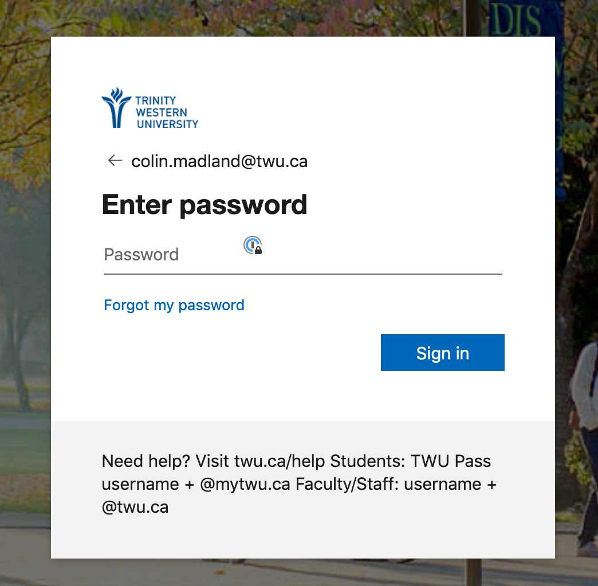
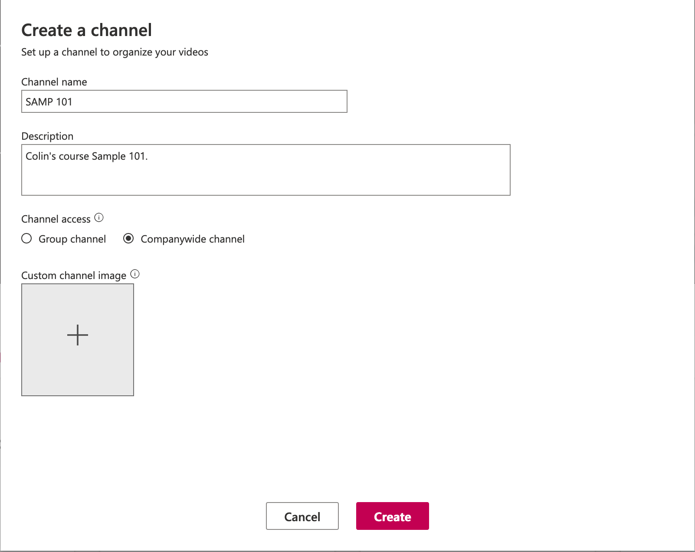

TWU has provided access to Microsoft Stream, which is like our very own YouTube, but accessible only to members of the TWU community.

When you record in Zoom, please record to your local computer, then upload to MS Stream.

### Accessing Stream

[Visit web.microsoftstream.com](https://web.microsoftstream.com) and sign in with your TWU Pass credentials, including your full TWU email address.

### Create a Channel

In the white menu bar at the top of the page, click 'Create' then choose 'Channel'.

### Channel Details

- Give your channel a name that corresponds to the code for your course, e.g. BIOL 113 A.
- Enter a description (optional)
- Choose 'Companywide channel'
- upload a custom channel image (the only appropriate image for a channel is a cat, obvs.)

!! NOTE: For now, your videos will be visible *in MS Stream* to anyone who is logged into TWU's MS Stream account. They are **NOT** visible to anyone outside of the TWU organization. We intend to deploy more robust controls.

### Upload Videos

- Click 'Follow' (optional)
- Either drag and drop files to the window, or click the link to navigate to your video file.

!!! Zoom recordings will be in .mp4 format.

- Name the video to make it easy for learners to find, including the date of the recording.
- Include a description or hashtags (optional)
- Choose a thumbnail (optional)
- Once the file has uploaded and has been processed, click 'Publish'.
- For now, don't change the permissions or options.

### Subsequent Videos

The next time you need to upload a video, start by clicking 'My content', then 'Channels', select the appropriate channel, and repeat the upload process above.
