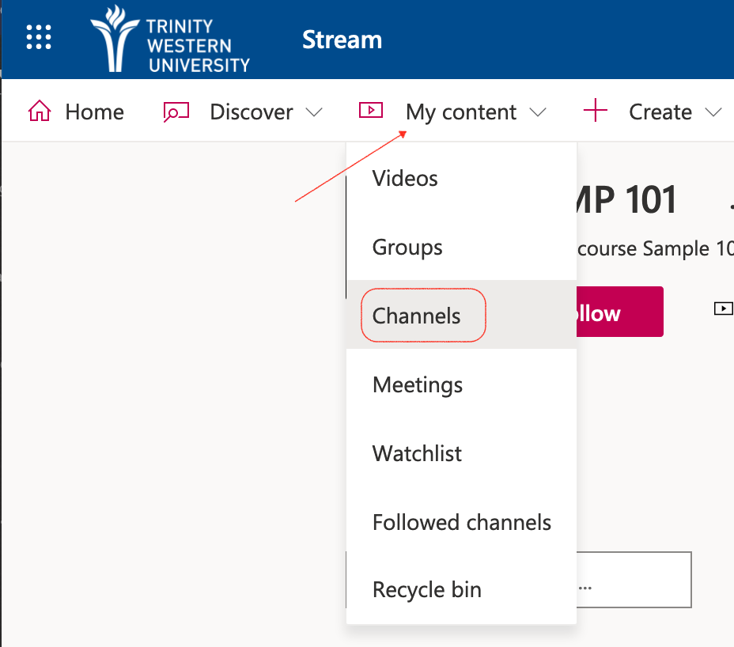
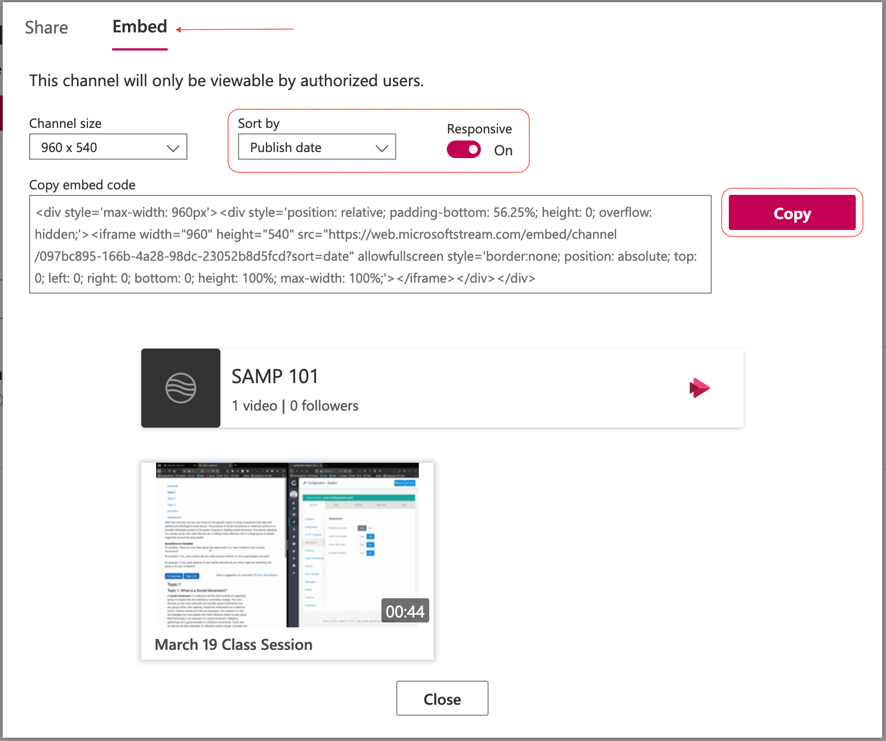
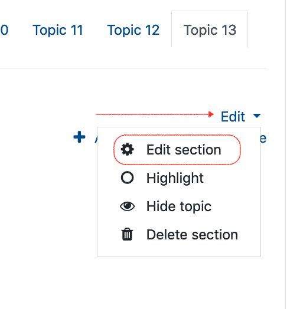
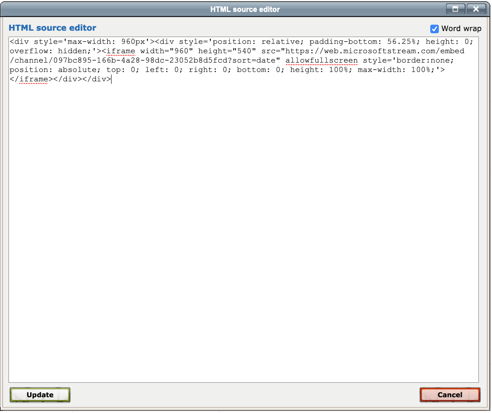
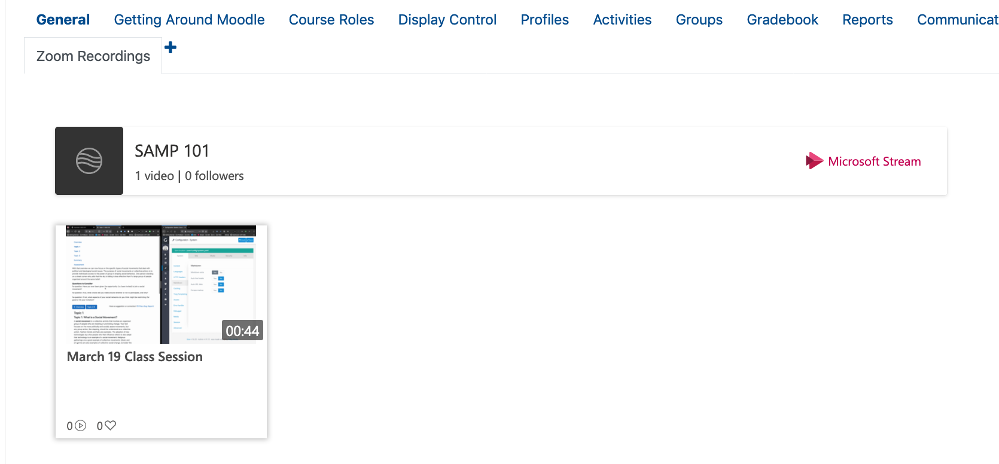

TWU has provided access to Microsoft Stream, which is like our very own YouTube, but accessible only to members of the TWU community.

!! When you record in Zoom, please record to your local computer, then upload to MS Stream.

### Accessing Stream

[Visit web.microsoftstream.com](https://web.microsoftstream.com) and sign in with your TWU Pass credentials, including your full TWU email address.

### Click 'My content', then 'Groups'.

### Click the title of the group.

Your group is named according to the course you are teaching.

### Click 'Channels' in the group, then 'Create a new channel'.

! Click Membership to ensure your class list is accurate.

You can also click 'Create a channel' on the splash page.

### Enter the channel details.

- Give your channel a descriptive name, likely one that matches your course, and an optional description.
- Keep the channel access limited to your course group.
- upload a picture of your cat
- click 'Create'.

### Upload Videos

- Click the channel
- Either drag and drop files to the window, or click the link to navigate to your video file.

!!! Zoom recordings will be in .mp4 format.

### Add Video Details
- Name the video to make it easy for learners to find, including the date of the recording.
- Include a description or hashtags (optional)
- Choose a thumbnail (optional)
- Once the file has uploaded and has been processed, click 'Publish'.
- For now, don't change the permissions or options.

!!!! Videos that you upload to channels that are in a private group will only be accessible to members of that group.

### Subsequent Videos

The next time you need to upload a video, start by clicking 'My content', then 'Channels', select the appropriate channel, and repeat the upload process above.

### Manage your computer storage

**After you have confirmed that your video is in the proper channel *AND* you have tested that it plays**, you should move the original video file off of your computer and either onto an external drive (optional) or simply delete it.

### Sharing your videos in Moodle

Once you have uploaded your video to MS Stream, you will want to share it with your learners.

- Go to your channel in MS Stream and click the ellipsis beside the title of the channel, then choose 'Share'

### Generate and Copy the Embed Code

- Choose 'Embed' at the top of the window.
- Change the sort order to 'Publish date'
- Set 'Responsive' to 'On'
- Click 'Copy'

### Open Moodle

You now need to paste the embed code into Moodle. We recommend that you paste the MS Stream channel on its own tab.

- Turn editing on by clicking the gear in the top right corner.

### Select an Empty Tab

Choose one of your tabs that doesn't have any content. If you don't have any empty tabs, click the '+' sign once.

- click the 'Edit' link then choose 'Edit section'.

### Edit Tab Details

- Select 'Custom' and edit the title to 'Zoom Recordings' (or similar)
- Toggle the toolbar to show more tools
- Click the '<>' button to edit the HTML source

### Paste Code

Use 'CTRL V' (Command V for macOS users) to paste the embed code, then click 'Update'. Then scroll down and click 'Save changes'.

### Your Videos are in Moodle

Once you have embedded the channel into your course, all videos that you add to the channel will automagically be visible in your course.

