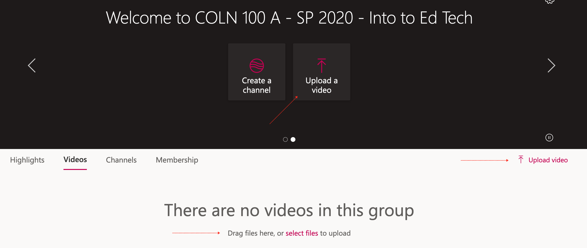
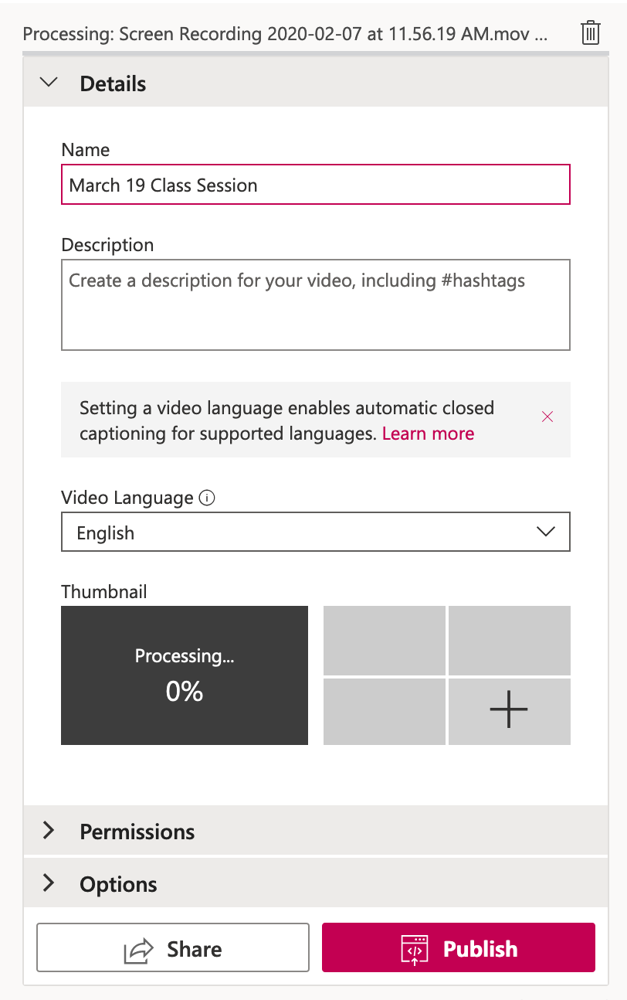
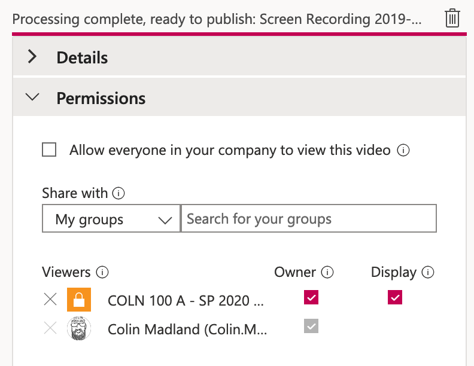

## For Faculty

! Scroll down for instructions for students.

We are currently testing the provisioning of 'Groups' in MS Stream that are based on each course being offered by TWU.

This means that you, as faculty can control to a much greater extent, who can and cannot see your videos.

### Sign in to MS Stream

[Click here for instructions for signing in to Stream](https://create.twu.ca/help/online-learning-on-ramp/running-a-session/conferencing/managing-videos)

!!! If you have already created a channel in Stream, unfortunately, there isn't a way (that I can see, yet) to edit your company wide channel to be a private channel. You will have to delete the original channel and follow the instructions below to create a new one connected to your group.

### Click 'My content', then 'Groups'.

### Click the title of the group.

Your group is named according to the course you are teaching.

### Click 'Channels' in the group, then 'Create a new channel'.

You can also click 'Create a channel' on the splash page.

### Enter the channel details.

- Give your channel a descriptive name, likely one that matches your course, and an optional description.
- Keep the channel access limited to your course group.
- upload a picture of your cat
- click 'Create'.

## For Students

### Sign in to MS Stream

[Click here for instructions for signing in to Stream](https://create.twu.ca/help/online-learning-on-ramp/running-a-session/conferencing/managing-videos)

### Click 'My content', then 'Groups'.

### Click the title of the group.

Your group is named according to the course you are taking.

### Click 'Channels' or, if your instructor has not created a channel, click 'Videos'.

!!!! Class groups are private groups, and if you upload a video to a private group, only members of that group will be able to see it.

There are three options to begin the upload process:

1. Click 'Upload a video' in the slider.
2. CLick 'Upload video' on the right side of the page.
3. Drag and drop a video file or click 'select files'.

### Add Video Details
- Name the video to make it easy for learners to find, including the date of the recording.
- Include a description or hashtags (optional)
- Choose a thumbnail (optional)
- Once the file has uploaded and has been processed, click 'Publish'.
- Under 'Permissions' deselect 'Allow everyone in your company to view this video'.
- Ensure that the list of viewers includes the private group.

!!!! Videos that you upload to channels that are in a private group will only be accessible to members of that group.

