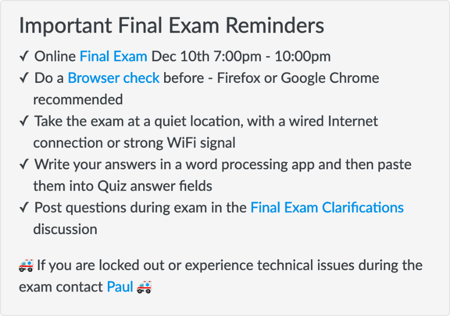
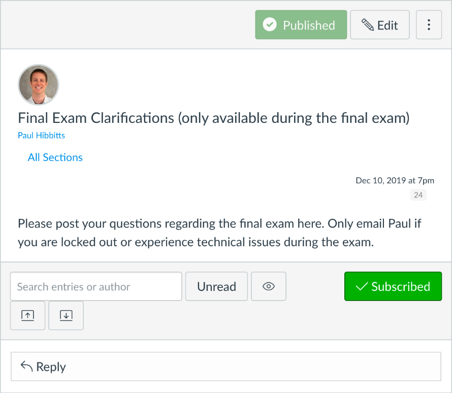
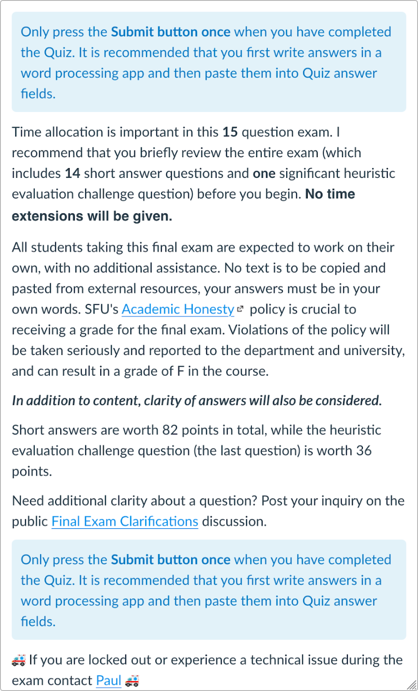

> _The following is based on Paul Hibbitts' experiences of delivering an online final exam using the Canvas LMS for his [CMPT-363 User Interface Design course](https://canvas.sfu.ca/courses/47119) at [Simon Fraser University](https://www.sfu.ca/) in December 2019 due to a pending region-wide public transit strike in Vancouver, BC. Your mileage may vary._

## Initial Steps

1. Consider how to make your planned face-to-face final exam an open-book friendly one. Open-book final exams are much better suited for online delivery where students have full access to the Web. I encouraged my students to study for an open book exam the same way they would for a closed book exam. Looking up materials takes T I M E.
2. In general, open-book final exams minimize “Remembering” and “Understanding” type questions and utilize higher-order thinking questions such as  “Applying”, “Analyzing”,  “Evaluating” and “Creating”, as described in [Bloom’s Taxonomy](https://en.wikipedia.org/wiki/Bloom%27s_taxonomy).
3. Try to construct one or two higher-order thinking questions to assess their suitability for your own course content etc. While it might not appear so, creating multiple-choice higher-order questions is often very challenging and time-consuming - consider using the short answer format which only requires text entry. Additional resources about creating an open book final exam are included at the end of this document.
4. Have your teaching assistant, or someone with suitable course knowledge, try to answer one or two of these questions to get a sense of time requirements, question format, etc. Considering doubling the resulting times to get a more realistic estimate in terms of time required for students.

## Creation

*   For almost all of your students, this will be their first online final exam._ It is critical that you consider it will take students a longer time to complete an online final exam than a face-to-face one._
*   As you continue to develop your online final exam try to pilot-test your questions with your teaching assistant or someone with suitable course knowledge.

## Preparations

*   Communicate as early as possible to your students that the online final exam will be open book/Internet (but not open neighbours!) Review any relevant academic honesty policies of your school with your students.
*   Provide students with important reminders for the upcoming online final exam. Here are the important reminders I shared with my students:

## Delivery

*   The [Quiz feature](https://create.twu.ca/help/moodle/faculty/quizzes/creating-a-quiz) in Moodle is quite capable of delivering an online final exam. Not only can you create a series of questions, but you can also only make the online final exam available with a set maximum duration and at a specific date/time. I choose a specific date/time as the final exam was already scheduled along with other final exams students had planned for. An open-book final exam is often also a prime candidate for a “take-home” style online final exam, and can reduce the stress that can come with possible technical issues related to online final exams.
*   However long you estimate your online final exam for students to complete you will be underestimating how long it will likely take! Always err on the side of giving students too much time when it comes to an online final exam. Again, remember that for many of them this will be their first online final exam - under already stressful situations.
*   Have a “Plan B” ready for students you for some reason cannot submit their final exam answers online using Moodle. This again highlights the importance of asking students to create a local document of their answers - if need be they can simply email this to you directly by the online final exam deadline. Be accomodating with these deadlines.
*   Just like a face-to-face final exam, students may need clarifications with online final exam questions. Create a single [Discussion forum](https://create.twu.ca/help/moodle/faculty/activity-or-resource/creating-a-forum) in Moodle which you will monitor during the entire final exam and promptly answer any posted questions. Since this is a forum available to all students, once an inquiry has been answered other students can quickly also locate that information. Here is the discussion forum I created for my students (I actually got the sense of being more ‘present’ for my students using an online discussion board during the final exam, and quite enjoyed being more available to them throughout the exam): \

*   Provide clear instructions for students on how they should proceed with the online final exam, such as creating a local word processing document to store all their answers and then copy/paste their answers onto the Moodle quiz itself. Here are the instructions I created for my students:

## Additional Resources

These are some resources on creating effective final exam questions which I found very helpful:

*   [Different Types of Questions based on Bloom's Taxonomy](http://faculty.academyart.edu/faculty/teaching-topics/teaching-curriculum/enhancing-teacher-student-interaction/different-types-questions-blooms-taxonomy.htmla/?p=686)
*   [Writing multiple-choice questions using Bloom’s Taxonomy](http://gradehub.com/blog/using-multiple-choice-questions-using-blooms-taxonomy)
*   [Asking Good Test Questions](http://teaching.cornell.edu/teaching-resources/assessment-evaluation/asking-good-test-questions)
*   [Exam Questions: Types, Characteristics, and Suggestions](http://uwaterloo.ca/centre-for-teaching-excellence/teaching-resources/teaching-tips/developing-assignments/exams/questions-types-characteristics-suggestions)

By Paul Hibbitts ([hibbittsdesign.org](http://hibbittsdesign.org/))

