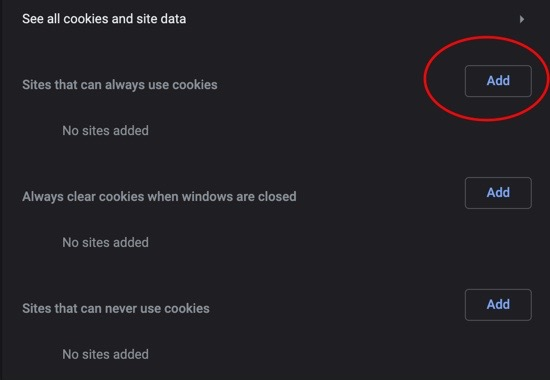

#### Google Chrome issues when grading Assignments in Moodle

Several faculty members have recently reported an issue with grading and feedback in Moodle while using Google Chrome . Here are some ways to address these concerns until updates are released.
If you are using Chrome , you may be unable to save grades and feedback entered on Assignment activities. The issue is likely caused by a change with how the latest version of Google Chrome aggressively blocks third-party cookies by default.
You can try adjusting your Chrome browser’s settings to “Allow Cookies” or to make an exception to allow cookies from Moodle using the information at the [Google Chrome Help page](https://support.google.com/chrome/answer/95647?co=GENIE.Platform%3DDesktop&hl=en).
You can tell the browser to allow cookies from Moodle specifically by using the steps outlined at the “Allow or block cookies for a specific site” section:
1. On your computer, open Chrome.
2. At the top right, click More and then Settings.
3. Under “Privacy and security,” click Cookies and other site data.
4. Next to “Sites that can always use cookies,” click Add.

5. Enter the web address.
- To create an exception for an entire domain, insert the following code
6. Select Add.

**Note:** If you do not want to adjust your Chrome settings, please use an alternative browser for the time being, until Google addresses the issue (if they address the issue). For the best experience, we recommend using Mozilla Firefox when working with Moodle.
