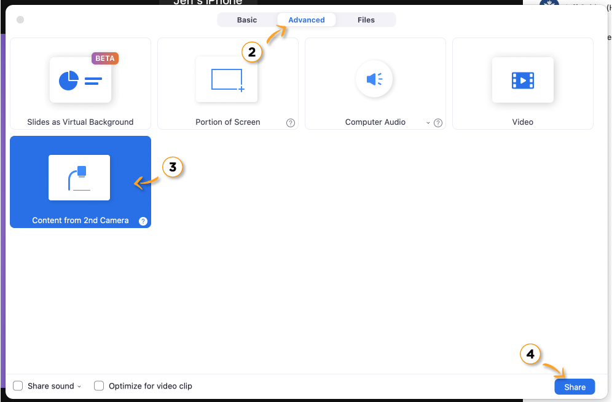
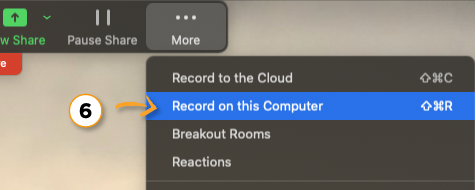
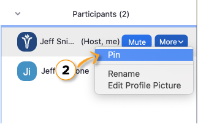
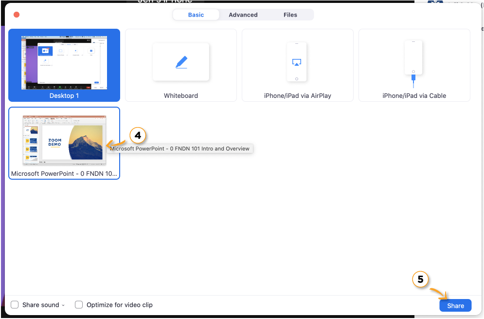
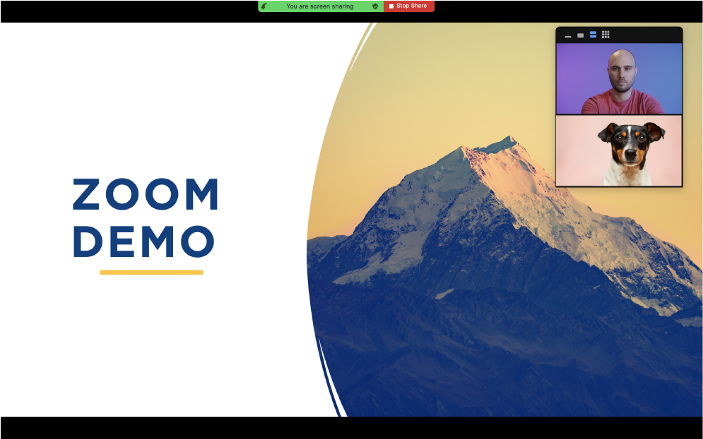
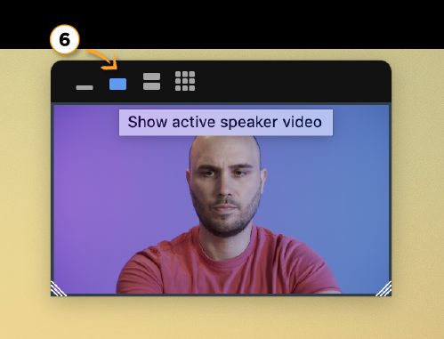
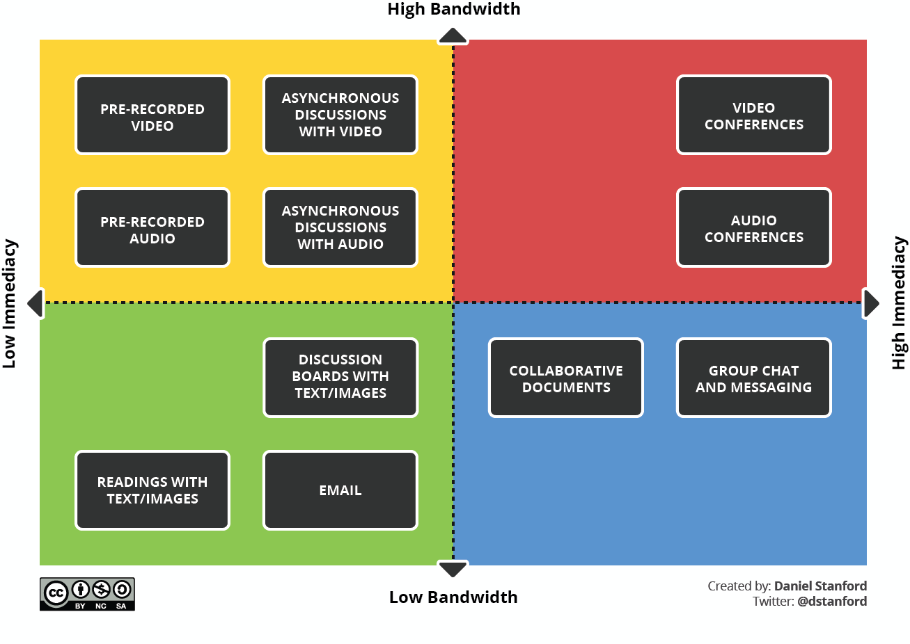

### Joining a Zoom Session

!!!! Faculty, please share this link with learners in your course!

[plugin:youtube](https://youtu.be/hIkCmbvAHQQ)

###How to Avoid Low Resolution Meeting Recordings
You've probably noticed by now that Zoom can be a little stingy when it comes to processing Zoom recordings. A short recording MAY result in a video file with a resolution of 720p, but a long recording will often be lower in quality.

Currently the best way to avoid low resolution Zoom recordings involves a little bit of trickery.
By asking Zoom to treat your webcam like a document camera, Zoom will improve the quality of your recordings in two ways.

####Pros
- Zoom will record at a higher resolution.
- The recording will be sharper. This might be especially helpful where detail (such as notes on a whiteboard) are important.
####Cons
- since Zoom sees your webcam as a screen-share (not as a webcam), you won’t be able to simultaneously share another screen.

####The Process
- At the bottom of your screen, click the ‘Share Screen’ button.

- Click Advanced, ‘Content from 2nd Camera’, ’Share’.

- If you have more than one camera, you may need to click the ‘Switch Camera’ button to get to the right camera input.

- Your camera will display, and you should now be able to record (for best results, record to computer).

- After your meeting has ended and your recording has processed your should have a file with a resolution of at least 1080p.
###Recording a Screen and Camera Simultaneously
- Enable your camera (if not on already)

- If you want to ensure that your camera will remain on screen at all times, under the ‘Participants’ tab, hover over your name and select ‘More’, then ‘Pin” from the dropdown.

- Click the ‘Share Screen’ button

- Under the ‘Basic’ tab, choose the application that you’d like to share, such as a Power Point Presentation (This option works slightly better than sharing your Desktop, as it will consistently place your camera in the same place in your recordings). Click Share.

- The focus should now shift to the application you selected.

- There are a few different options available for displaying participants. If you’d like only your camera to be visible, select the ‘Show active speaker video’ Option

- Once you’ve chosen who will be visible in your recording, you can choose to have the participants overlay as large or small by clicking and dragging the corner of the overlay window.

!! NOTE: Although you can move the participants overlay anywhere on your screen, in the final recording, the participants overlay will always be in the top right corner.

### A note about Bandwidth

Our faculty colleague Kay McAllister passed along this blog post about recognizing the challenges of bandwidth for some learners. [Here is a link to the post](https://www.iddblog.org/videoconferencing-alternatives-how-low-bandwidth-teaching-will-save-us-all/?fbclid=IwAR2fBxmBCuZOHfG811nfHU9nNLsHetYKME_6YQjPIMDgCckDSUg85wnSH_E), and a helpful matrix to visualize the varying levels of bandwidth and immediacy.

!! NOTE: The resources on this page are from a webinar hosted by the Online Learning Consortium on March 9, 2020. Do not feel that you need to implement every one of these recommendations! Pick one or two over which you feel you have control.

## Teaching a Live, Online Session Checklist & Resources
This document is designed for those of you who will be facilitating and supporting live, online sessions under emergency or unexpected conditions. The technical details focus on Zoom, so if you are using a different platform, make sure to customize the steps for that specific software, though the general tips are platform agnostic.

You will likely use a mix of asynchronous (not in the same place at the same time) and synchronous (same place, same time) types of instruction in your online courses. Live, online sessions are an example of synchronous instruction, and that “same place” is the Zoom platform, with everyone joining from the privacy of their own home/office, connecting online.

This checklist is not intended to be a replacement for the platform vendor’s own “best practices” and troubleshooting documentation. Be sure to spend adequate time testing your platform and bookmarking useful guides, such as Zoom’s Webinar and Meeting Best Practices article.

After you read through this checklist, make it your own by deleting, adding, and otherwise modifying it to suit your own needs and goals.

#### Create & Share Your Session Details
- **Create your live session on the platform of your choice.** Follow Zoom’s directions for scheduling meetings (“Web” for basic directions), or directions from your selected platform.
- **Share your session link with students.** Users can join by computer and telephone (Zoom also has a mobile app). Remind students of any work that should be completed to prepare for the session.

#### Reminders
- **Remind students of your session start date/time.** Send an email the day before and then about an hour before your session starts. If you have other ways to reach your students (Remind texting service, your LMS, etc.), multiple points of outreach are ideal.
- **Remind yourself.** For those used to commuting to campus and land-based teaching, online sessions will be quite different. They can be easy to forget. Set a few alarms on your personal devices. Give yourself plenty of time, to allow for any technical challenges.
- **Remember accessibility.** Consult with your institution’s accessibility services office, especially if you have students with documented requests for accommodations that could be impacted by the shift from land-based to online learning.
- **Less is more.** Don’t expect to be able to accomplish as much as you’d like, especially in your first few sessions. Allow plenty of time to get everyone comfortable with using the online platform and to answer questions. Prioritize checking in with students on a human level. You might have to sacrifice some content. Remember, your best is good enough.

#### Session Preparation Essentials
- **Share technical guides with your audience.** It might be someone’s first time in Zoom, so consider sending a short tutorial on testing audio/video in advance. Include this in your reminder email along with other information that your students need in order to come prepared (assignments, readings, etc.)
- **Use a headset and a microphone.** This provides a clear way to capture your voice, and allows you to more clearly hear conversations. Encourage your participants to do the same. Basic earbuds that include a microphone also work very well.
- **Position your webcam and light source.** An external (USB) camera such as the Logitech C920 might provide a better visual experience for your audience than your built-in laptop webcam, but use what you’ve got. Position your webcam at eye-level (a stack of textbooks works well as a “booster seat”). Position your light source directly in front of you to illuminate your face. To see this in action, [watch this short (2 minute) video](https://youtu.be/FMex-9FyljU).
- **Run a tech check.** Test your computer, camera, and microphone in the video conferencing platform at least 24 hours before your scheduled meeting by logging into your session. Use  all the equipment (including headset or earbuds) that you plan to use during your session.
- **Join from a location with a strong and stable internet connection.** Reduce background noise by going to a private space. A wired connection is best. If you are using WiFi, then connect from your home or office. Public locations can be spotty.
- **Be on time.** Plan to arrive at least ten minutes before your scheduled meeting. Do another tech check and prepare your desktop for screen-sharing. You can also start interacting with your learners in the chat. Lots of great conversations happen before sessions even begin.
- **Appearance matters.** Clean up your background (what is visible behind you in your physical location) to ensure that it’s appropriate/not distracting. Check your lighting conditions. Lastly, be aware of your behavior. When you are on video, people can see what you are doing at all times. It can be easy to forget you’re on camera, so just be mindful.
- **Consider recording the meeting.** This allows you to share it with learners who weren’t able to attend (or who had to call in from a landline). Make sure that everyone consents before proceeding. If you might forget to record, set a (quiet) alarm to nudge you.

#### Interacting with Participants
- **Demonstrate instructor presence.** If you are making a rapid shift from land-based to online instruction, your students will likely know you already. However, take a moment to say “hello” and share something appropriately personal at the start of the session to break the ice. Check in with your students via the chat and see how they are managing.
- **Support and refer.** Ask your institution to provide faculty with a list of school and community resources to support students during a crisis. Consider sharing this in your meeting preparation/reminder emails in advance of each session.
- **Set expectations early on.** Share the agenda and explain how you want your learners to participate. Should they use non-verbal feedback to simulate hand-raising? Add questions and comments in the chat? Will you make use of breakout rooms for small group discussions? Be clear, and take a few minutes to demonstrate the features you’ll be using (and which you expect participants to use).
- **Mute audio when not speaking.** All noises can be picked up by your microphone including typing, shuffling papers, etc. Minimize distractions by muting your microphone when you’re listening. If you are the meeting host (main presenter), you can mute others.

#### In-Meeting Tips
- **Mute audio when not speaking.** All noises can be picked up by your microphone including typing, shuffling papers, etc. Minimize distractions by muting your microphone when you’re listening. If you are the meeting host (main presenter), you can “mute all.”
- **Check the chat box.** Some participants might not be able to speak up during the meeting. Others might have technical difficulties. The chat box can be used to address those issues as well as provide another place where conversation can take place during the meeting.
- **Check on your screen-sharing.** If you’re not sure whether your participants see the content you’ve intended to screen-share, ask them! If something’s not working right, remember that you can always send files or website links to your participants through the chat. Do your best and don’t let tech challenges throw you off track.

#### Engagement Tools
- **Start and end strong.** Primacy-recency effect states that people will most remember the first and last five minutes of a learning experience. Use your time wisely by planning a strong start and finish. Stories, videos, images, chats, and polls can all boost engagement.
- **Use the chat.** The chat is your best friend in an online session. While we might discourage chatting in a land-based classroom, the opposite is true in an online session. Encourage your students to comment about the topic at hand in the chat. This will keep them engaged and active. Ask lots of questions, especially if you’re lecturing, and comment on students’ responses in the chat. It’s very easy to use the chat for an informal poll (e.g., share one word that comes to mind when you think of today’s topic). Formal polls take time to create.
- **Switch it up.** Just as we want to be mindful of the length of lectures in a land-based classroom, the same is true in an online session. In addition to punctuating your lecture with questions and engaging students in the chat, try not to lecture for more than 10 minutes. Take a break, do an activity, and then resume your lecture if needed.
- **Try a breakout room.** Regardless of the size of your class, you can use breakout rooms in Zoom meetings to boost engagement. Zoom allows you to divide your meeting into 50 separate sessions. Make sure to set clear expectations for what students should be doing in the breakout room (e.g., assign a timekeeper, reporter, leader, etc.). Breakout rooms are not recorded and the chat will switch from a session-wide chat to a breakout room only chat. Students can call on the presenter/teacher for help from within the breakout room. See [How to use Breakout rooms in Zoom for Teaching and learning](https://www.youtube.com/watch?v=VkK5WEf6xgk).
- **Assess student learning.** Assessment gets a bad rap. It’s not what many of us think it is. Rather, it’s a tool to help students AND faculty to teach and learn best. [This list of 50 Classroom Assessment Techniques (CATs)](https://create.twu.ca/help/online-learning-on-ramp/finishing-well/50-cats) includes tons of “just-in-time” assessments that you can use to get a read on student learning. Most of these are easily transferable to an online session, and you can use them in a poll or chat. Another alternative is to make use of Google docs, which allows students to easily collaborate on a shared document in real-time or asynchronously. Some of these CATs would work well in Google docs.

#### Acknowledging Anxiety
- **Recognize your own anxiety.** Aside from the abrupt shift from land-based to online instruction, the reasons behind that shift might be ramping up our stress and anxiety. It is also very normal to feel camera-shy, even if you’ve been teaching in front of a classroom for years. Take a deep breath, and remember that perfection is not the goal. Be human, do your best, and ask for help when you need it.
- **Recognize your students’ anxiety.** Just as these rapid shifts will elicit strong emotions from faculty, so too will our students likely experience higher levels of stress and anxiety that might impact their classroom behavior or experience.

#### Wrapping Up
- **Remember to stop the recording.** Tell your participants when you do so, as they might have some questions that they were too shy to pose during the recording.
- **Stick around a bit.** Wait for a few participants to leave before you hit the “end meeting” button, so that the closing doesn’t feel so abrupt. Thank participants for their time and remember to send any follow-up materials as close as possible to the session timing, so that it’s still fresh in participants’ minds.

## Online Lesson Planning Template for Faculty

| Time | Strategy | Your Plans/Notes |
|---|---|---|
|  | **Warm Welcome/Check-in**   Welcome students to class. Arrive 10 minutes early to allow time for informal chat. Remind students of resources and support.|  |
|   | **Activate Prior Knowledge**   Share a quick video or story about the day’s topic. Ask students to share in the chat their definition/thoughts on the day’s topic or run a quick poll.  |   |
|   | **Lecture**   Share slides (Google Slides are awesome). Punctuate your lecture with lots of questions. Encourage participation in the chat. Consider having students work in a shared Google doc during the lecture. Be mindful of lecture length.   |   |
|   | **Questions**   Pause and allow time for questions. Students can come on-camera in most platforms. Also encourage chat questions. |   |
|   | **Activity**   Run a group activity via breakout rooms in Zoom. Provide clear expectations and assign one person in each group to be the reporter, another to be timekeeper, and another to keep the group on task. |   |
|   | **Process Activity**   Bring students back into the main room and ask each group to report out. Process together as a large group. |   |
|   | **Repeat Lecture, Questions, Activity, and Process Activity as needed.**  |   |
|   | **Plans for Next Class**   Review plans and expectations for the next meeting. Clarify what students will need to do on their own time. Review resources. |   |
|   | **Formative Assessment**    Use poll, chat, or a Google doc to perform a quick, formative assessment of student learning. The list of 50 CATs is a resource.|   |

#### Resources
- [How online learning during coronavirus has changed Chinese education](https://supchina.com/2020/02/20/china-online-learning-during-coronavirus-has-changed-status-quo/): This article describes the Chinese “stop classes, don’t stop learning” approach, and explores cultural differences in education between countries and how online learning highlights some of those differences. For teachable moments, share content like this for class discussion.
- [Emergency Remote Teaching Guidelines](https://docs.google.com/spreadsheets/d/1VT9oiNYPyiEsGHBoDKlwLlWAsWP58sGV7A3oIuEUG3k/edit#gid=1552188977): This POD (Professional & Organizational Development network) spreadsheet offers links to institutions’ continuity resources.
- [OLC Continuity Planning and Emergency Preparedness](https://onlinelearningconsortium.org/about/continuity-planning-emergency-preparedness-resources/): This website includes a variety of resources including links to webinars, podcasts, and courses in teaching online.
- [Effective Online Teaching](https://www.amazon.com/Effective-Online-Teaching-Foundations-Strategies/dp/0470578386): Foundations and Strategies for Student Success (Book)
- [Empowering Online Learning](https://www.amazon.com/Empowering-Online-Learning-Activities-Reflecting/dp/0787988049): 100+ Activities for Reading, Reflecting, Displaying, and Doing (Book)
- [How to use Breakout rooms in Zoom for Teaching and learning](https://www.youtube.com/watch?v=VkK5WEf6xgk).
