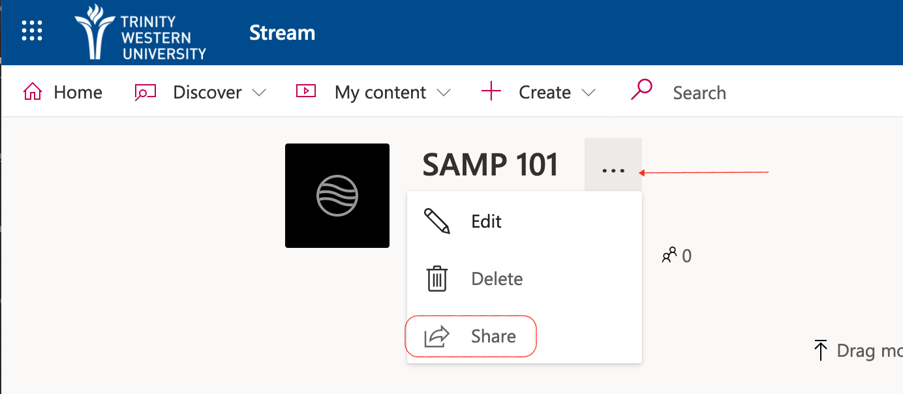
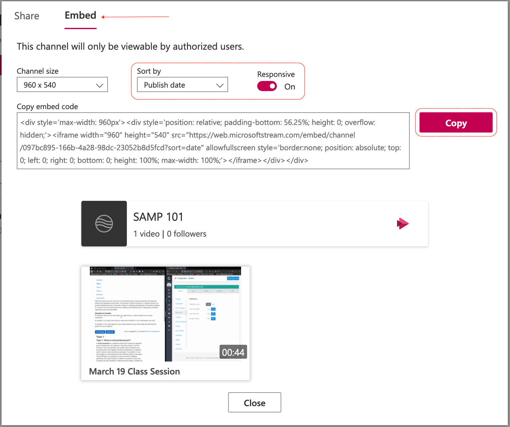
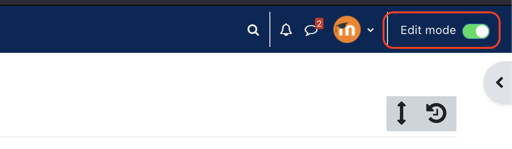
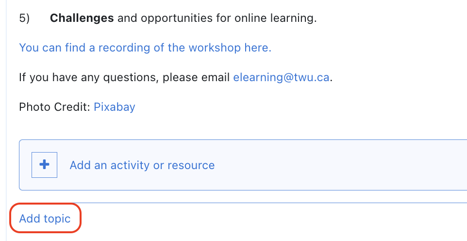
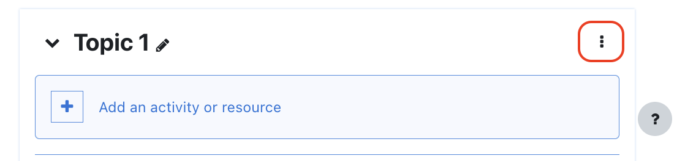
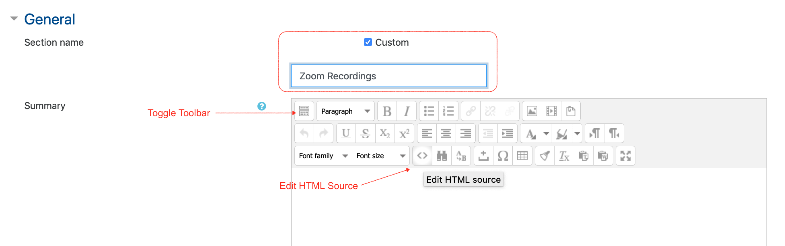
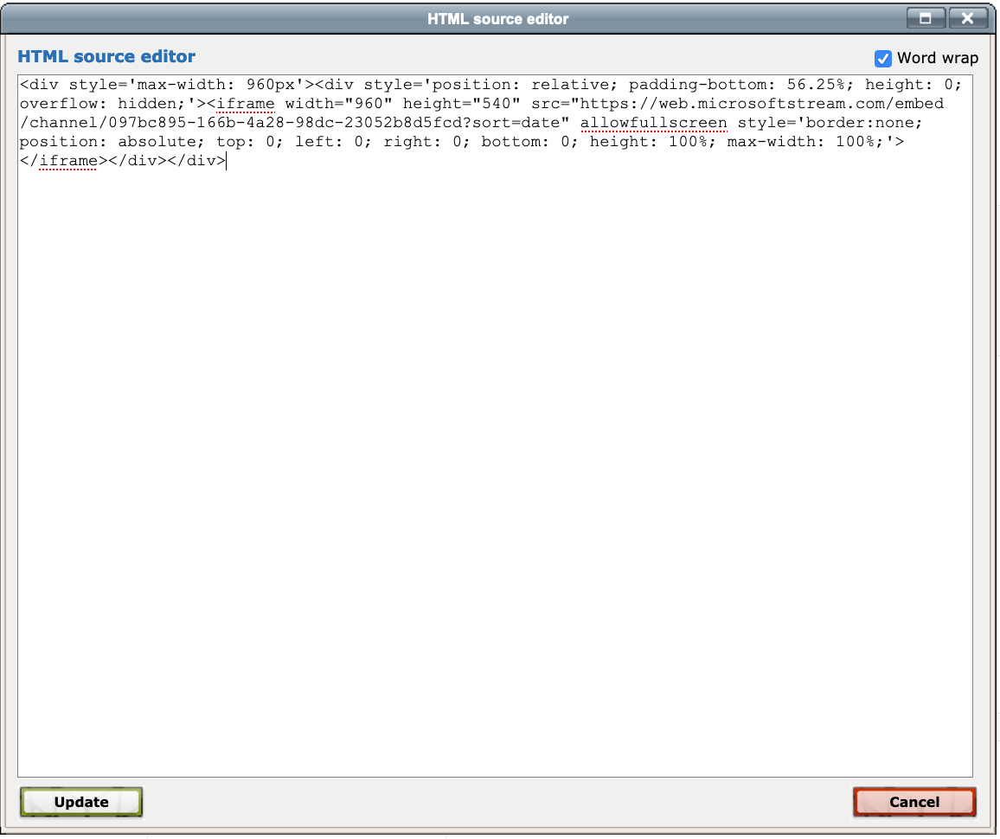
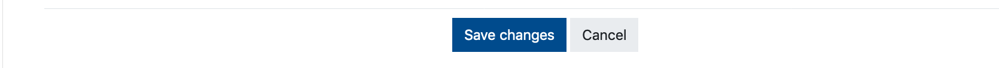
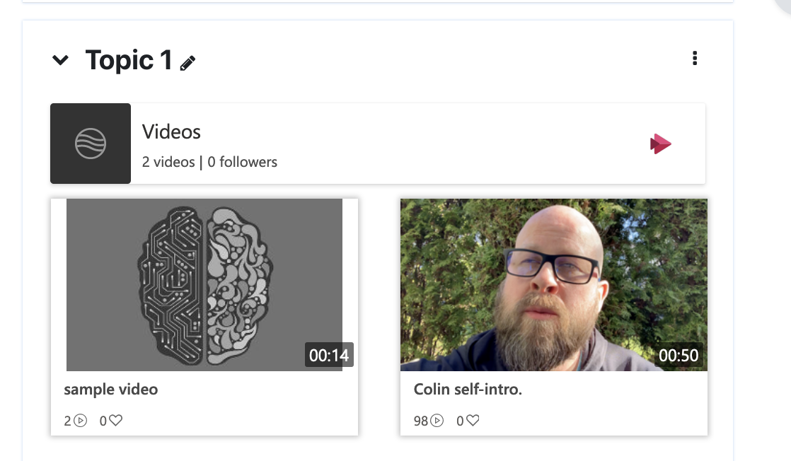

### Sharing your videos in Moodle (optional, but recommended)

Once you have uploaded your video to MS Stream, you will want to share it with your learners.

- Go to your channel in MS Stream and click the ellipsis beside the title of the channel, then choose 'Share'

### Generate and Copy the Embed Code

- Choose 'Embed' at the top of the window.
- Change the sort order to 'Publish date'
- Set 'Responsive' to 'On'
- Click 'Copy'

### Open Moodle

You now need to paste the embed code into Moodle. We recommend that you paste the MS Stream channel in its own section.

- Turn editing on by clicking 'Edit mode'' in the top right corner.

### Create or select a new topic

To create a new topic, open the topic that precedes the desired location of your new topic, scroll to the bottom of the topic, and click 'Add topic'

- click the three dots on the right side, then choose 'Edit topic'.

### Edit Tab Details

- Select 'Custom' and edit the title to 'Zoom Recordings' (or similar)
- Toggle the toolbar to show more tools
- Click the '<>' button to edit the HTML source

### Paste Code

Use 'CTRL V' (Command V for macOS users) to paste the embed code, then click 'Update'. Then scroll down and click 'Save changes'.

### Your Videos are in Moodle

Once you have embedded the channel into your course, all videos that you add to the channel will automagically be visible in your course.

